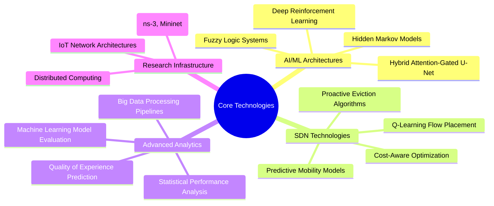

# Hi there, I'm Gan Huang! 👋

*"The state is made for man, not man for the state." ― Albert Einstein*

*"If research only remains on paper and never translates into real-world applications, it loses its value. Innovation matters most when it makes a difference beyond the pages."*

---

## 🚀 About Me

I'm a **Postdoctoral Researcher** in AI Agents at Ariel University, Israel, with a **core mission**: **transforming research into real-world impact**. I believe that research only has true value when it moves beyond academic papers to create tangible solutions that benefit society. My current work focuses on developing **advanced AI agents** capable of adaptive reasoning, autonomous decision-making, and human–AI collaboration, integrating machine learning, natural language processing, and multi-agent systems for dynamic and complex environments.

### 🎯 Current Technical Focus
- 🤖 **AI Agent Development**: Designing AI agents with enhanced interpretability and trustworthiness for adaptive reasoning and autonomous decision-making
- 🤝 **Human-AI Collaboration**: Developing frameworks for human–AI interaction and cooperative problem-solving in complex environments
- 🔄 **Multi-Agent Systems**: Investigating multi-agent coordination and emergent behaviors in real-world scenarios
- 🏥 **Applied AI Research**: Applying AI agent architectures to domains such as education, healthcare, and computational social science
- 🦙 **LLM & RAG Systems**: Exploring Large Language Model applications with LangChain, LangSmith, LangGraph, and LlamaIndex for intelligent document processing

### 🌍 Academic Journey
- 🇮🇱 **Postdoctoral Researcher** @ Ariel University (2025-Present)
- 🇮🇩 **Assistant Professor** @ Nusa Putra University (2024-August 2025)
- 🇨🇳 **Lecturer** @ Zhejiang A&F University (2023-2024)
- 🇹🇷 **Postdoc Researcher** @ Sabanci University (2021-2022)
- 🇰🇷 **PhD** @ Sungkyunkwan University (2016-2021)

---

## 🛠️ Tech Stack

### 💻 Programming Languages

### 🧠 Advanced AI/ML & Deep Learning

### 🦙 Large Language Models & RAG

### 🔧 Tools & Technologies

### 🌐 Network & Simulation

### ☁️ Cloud & Data Platforms

---

## � Research Philosophy: From Paper to Practice

### 🎯 **"Research without real-world application is just academic exercise"**

I firmly believe that **the true measure of research success is not in publications alone, but in how effectively we translate theoretical discoveries into practical solutions**. My approach to research follows a clear principle:

🔬 **Research** → 🛠️ **Development** → 🚀 **Implementation** → 🌍 **Impact**

### Why This Matters:
- **🎯 Purpose-Driven**: Every project targets a real-world problem
- **🔄 Iterative Approach**: Continuous feedback from practical implementation
- **🤝 Collaboration**: Working with industry to ensure applicability
- **📈 Measurable Impact**: Success measured by real-world adoption and effectiveness

### Current Applications:
- **Smart Cities**: AI-powered waste management systems
- **Network Optimization**: SDN solutions for IoT infrastructure
- **User Experience**: QoE models for mobile gaming platforms
- **Education**: Practical big data courses for industry readiness

---

## �📊 Research Metrics

| 🎓 Education | 📝 Publications | 🏆 Experience | 🌐 International |
|:---:|:---:|:---:|:---:|
| **PhD** in Computer Engineering | **4** SCIE Papers | **3+** Years Teaching | **4** Countries |
| **MS** Computer Applied Tech | **6** Conference Papers | **2** Years Postdoc | **3** Continents |
| **BS** Electronic Info Eng | **1** Under Review | **10+** Projects | **Multiple** Languages |

---

## 🔬 Advanced Research Methodologies & Technologies

### 🧪 Technical Research Approach
- **Machine Learning Integration**: Applying advanced ML techniques to network optimization problems
- **Hybrid Model Development**: Combining attention mechanisms with reinforcement learning for dynamic classification
- **Predictive Analytics**: Developing Q-learning approaches for mobility-aware network management
- **Performance Optimization**: Creating proactive algorithms for SDN flow table management

---

## 📈 GitHub Analytics

---

## 🚀 Advanced Technical Projects & Research Infrastructure

| Project | Advanced Technologies | Technical Innovation | Impact Metrics | Status |
|---------|----------------------|---------------------|----------------|--------|
| 🧠 **Hybrid Attention-Gated U-Net + DRL** | Deep Reinforcement Learning, Computer Vision, Attention Mechanisms | Dynamic waste classification with real-time learning capabilities | Smart city infrastructure optimization | 🔄 Under Review (IEEE TII) |
| 🌐 **Q-Learning SDN-IoT Architecture** | Q-Learning Algorithms, Predictive Mobility Models, Cost-Aware Optimization | Intelligent flow placement in software-defined IoT networks | Network performance enhancement (SCIE Q2) | ✅ Published |
| 🎮 **ML-Based QoE Prediction Engine** | Deep Learning, Statistical Modeling, Performance Analytics | Real-time quality prediction for mobile gaming platforms | User experience optimization (CORE Tier C) | ✅ Published |
| 🔍 **Proactive SDN Flow Management** | Hidden Markov Models, Fuzzy Logic, Machine Learning | Predictive flow entry eviction for network optimization | Network efficiency improvement (SCIE Q1) | ✅ Published |

### 🛠️ Research Infrastructure & Methodologies
- **Network Simulation**: ns-3, Mininet for large-scale network modeling
- **Machine Learning Pipeline**: TensorFlow, PyTorch for deep learning implementations  
- **Data Analytics**: R, MATLAB, Apache Spark for big data processing
- **Performance Evaluation**: Statistical analysis, hypothesis testing, model validation

---

## 🏆 Recent Achievements

🎓 **PhD Graduate** - Sungkyunkwan University (Ranking: 87th in Times 2026)  
🤖 **Postdoctoral Researcher** - Ariel University (AI Agents & Multi-Agent Systems)  
🔬 **Postdoc Completed** - Sabanci University (Ranking: 351st-400th in THE 2025)  
📚 **Former Assistant Professor** - Nusa Putra University (2024-August 2025)  
📖 **Guest Editor** - AI Journal Special Issue on IoT Data Aggregation  
🌟 **IEEE Member** - Member #98838908  
🏆 **Duolingo English Certificate** - Score: 120 (2024)  
💡 **Research Impact** - Converting theoretical algorithms into deployable AI agent solutions  

---

## 📚 High-Impact Technical Publications

### 🔥 Advanced Research Contributions
   
1. **Predictive mobility and cost-aware flow placement in SDN-based IoT networks: a Q-learning approach** *(2024)*  
   *Journal of Cloud Computing* - **SCIE Q2** | **Machine Learning + SDN Integration**
   
2. **Deep Learning-Based QoE Prediction for Streaming Services in Mobile Networks** *(2022)*  
   *WiMob Conference* - **CORE Tier C, QUALIS Tier B1** | **Neural Network Performance Prediction**
   
3. **Proactive eviction of flow entry for SDN based on hidden Markov model** *(2020)*  
   *Frontiers of Computer Science* - **SCIE Q1** | **Probabilistic Network Optimization**

### 📊 Research Impact Metrics
- **2** SCIE Journal Publications (Q1-Q2 Impact Factor)
- **4** International Conference Papers
- **Advanced ML Techniques**: Hidden Markov Models, Deep Reinforcement Learning, Q-Learning, Fuzzy Logic
- **Technical Domains**: SDN, IoT, Computer Vision, Quality of Experience, Network Security

---

## 🎓 Teaching Portfolio

| Course | Level | Institution | Year |
|--------|-------|-------------|------|
| **MI24M: Big Data Analysis + Research Methodology** | Master's | Nusa Putra University | Autumn 2024 |
| **DS1102: Big Data Analysis** | Master's | Nusa Putra University | Spring 2024 |
| **IF22021: Big Data** | Bachelor's | Nusa Putra University | Spring 2024 |
| **C3502066: Computer Network** | Bachelor's | Zhejiang A&F University | Autumn 2023 |

---

## 🌟 Advanced Technical Certifications

🏅 Click to expand advanced certification portfolio

### 🧠 Advanced AI/ML Specializations
- **Retrieval Augmented Generation (RAG)** - DeepLearning.AI, Stanford University (Coursera) - ID: LSYKEUSC16LA (August 2025)
- **Machine Learning Specialization** - Stanford University (DeepLearning.AI) - Advanced algorithms, neural networks, and optimization
- **Unsupervised Learning, Recommenders, Reinforcement Learning** - Stanford University - Advanced ML techniques including RL
- **Generative AI for Everyone** - DeepLearning.AI - Large language models and generative AI systems
- **Advanced Learning Algorithms** - Stanford University - Deep neural networks and optimization

### 📊 Data Science & Analytics Expertise
- **Data Mining Specialization** - University of Illinois Urbana-Champaign - Pattern discovery, clustering, text mining
- **Cluster Analysis in Data Mining** - Advanced unsupervised learning techniques
- **Text Mining and Analytics** - Natural language processing and text analysis
- **Data Visualization** - Advanced visual analytics and statistical representation
- **Big Data Introduction** - UC San Diego - Distributed systems and big data processing

### 🌐 Network Engineering & Systems
- **Networking Fundamentals** - Illinois Tech - Advanced network protocols and architectures
- **IoT Foundations** - Internet of Things system design and implementation
- **Introduction to Network Routing** - Advanced routing algorithms and protocols

### 💻 Programming & Technical Skills
- **Python Programming Specialization** - University of Michigan - Advanced Python for data science and ML
- **C Programming Fundamentals** - University of California, Santa Cruz - Systems programming

---

## 🌍 Connect With Me

---

### 📍 Location & Contact
🌏 **Currently in:** Israel  
📧 **Email:** ahczhg@gmail.com  
📱 **WhatsApp:** +82 10-7496-6266  
🎂 **Age:** 34  

---

### 🎯 Fun Facts

💡 **Research Philosophy:** Converting theoretical research into practical, real-world solutions  
🌍 **Impact Focus:** Making technology work for people, not just papers  
🚀 **Innovation Mindset:** Research has value only when it transforms into tangible applications  
🏃‍♂️ **Hobbies:** Basketball, Fitness, Reading, Music  
🌟 **Goal:** Contributing to sustainable technology solutions that change lives  
📚 **Currently Reading:** Latest papers on LLM applications in networking - with implementation in mind  

---

**⭐ From [Gan Huang](https://github.com/skkuhg) - Transforming research into reality, one innovation at a time! ⭐**

