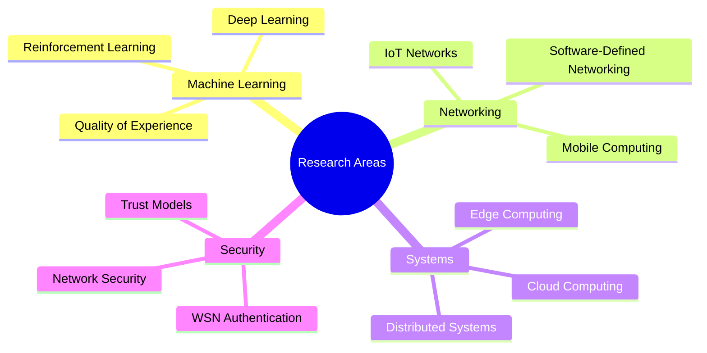

# Hi there, I'm Gan Huang! 👋

*"The state is made for man, not man for the state." ― Albert Einstein*

---

## 🚀 About Me

I'm an **Assistant Professor** in Computer Science at Nusa Putra University, Indonesia, with a **core mission**: **transforming research into real-world impact**. I believe that research only has true value when it moves beyond academic papers to create tangible solutions that benefit society. My work in **Machine Learning**, **Software-Defined Networking (SDN)**, and **Quality of Experience (QoE)** focuses on practical implementations that solve real problems across three continents.

### 🎯 Current Focus
- 🔬 **Research**: Hybrid Attention-Gated U-Net with Deep Reinforcement Learning for Dynamic Waste Classification
- 👨‍🏫 **Teaching**: Big Data Analysis, Research Methodology (Master's level)
- 🌱 **Learning**: Advanced AI/ML techniques, LLM applications
- 🚀 **Mission**: Bridging the gap between theoretical research and practical solutions

> *"If research only remains on paper and never translates into real-world applications, it loses its value. Innovation matters most when it makes a difference beyond the pages."*

### 🌍 Academic Journey
- 🇮🇩 **Assistant Professor** @ Nusa Putra University (2024-Present)
- 🇨🇳 **Lecturer** @ Zhejiang A&F University (2023-2024)
- 🇹🇷 **Postdoc Researcher** @ Sabanci University (2021-2022)
- 🇰🇷 **PhD** @ Sungkyunkwan University (2016-2021)

---

## 🛠️ Tech Stack

### 💻 Programming Languages

### 🤖 AI/ML Frameworks

### 🔧 Tools & Technologies

---

## � Research Philosophy: From Paper to Practice

### 🎯 **"Research without real-world application is just academic exercise"**

I firmly believe that **the true measure of research success is not in publications alone, but in how effectively we translate theoretical discoveries into practical solutions**. My approach to research follows a clear principle:

🔬 **Research** → 🛠️ **Development** → 🚀 **Implementation** → 🌍 **Impact**

### Why This Matters:
- **🎯 Purpose-Driven**: Every project targets a real-world problem
- **🔄 Iterative Approach**: Continuous feedback from practical implementation
- **🤝 Collaboration**: Working with industry to ensure applicability
- **📈 Measurable Impact**: Success measured by real-world adoption and effectiveness

### Current Applications:
- **Smart Cities**: AI-powered waste management systems
- **Network Optimization**: SDN solutions for IoT infrastructure
- **User Experience**: QoE models for mobile gaming platforms
- **Education**: Practical big data courses for industry readiness

---

## �📊 Research Metrics

| 🎓 Education | 📝 Publications | 🏆 Experience | 🌐 International |
|:---:|:---:|:---:|:---:|
| **PhD** in Computer Engineering | **4** SCIE Papers | **3+** Years Teaching | **4** Countries |
| **MS** Computer Applied Tech | **6** Conference Papers | **2** Years Postdoc | **3** Continents |
| **BS** Electronic Info Eng | **1** Under Review | **10+** Projects | **Multiple** Languages |

---

## 🔬 Research Interests

---

## 📈 GitHub Analytics

---

## 🎯 Current Projects

| Project | Description | Real-World Impact | Status | Tech Stack |
|---------|-------------|-------------------|--------|------------|
| 🗂️ **Waste Classification AI** | Hybrid Attention-Gated U-Net with Deep RL | Smart city waste management systems | 🔄 In Progress | Python, TensorFlow, DRL |
| 🌐 **SDN-IoT Networks** | Predictive Mobility & Cost-Aware Flow Placement | Optimized network infrastructure for IoT deployments | ✅ Published | Python, Mininet, Q-Learning |
| 🎮 **QoE Gaming Model** | Quality of Experience Prediction for Mobile Gaming | Enhanced user experience in mobile gaming platforms | ✅ Published | Python, ML, Statistical Analysis |

---

## 🏆 Recent Achievements

🎓 **PhD Graduate** - Sungkyunkwan University (Ranking: 123rd in QS 2025)  
🔬 **Postdoc Completed** - Sabanci University (Ranking: 351st-400th in THE 2025)  
📚 **Assistant Professor** - Nusa Putra University  
📖 **Guest Editor** - AI Journal Special Issue on IoT Data Aggregation  
🌟 **IEEE Member** - Member #98838908  
💡 **Research Impact** - Converting theoretical algorithms into deployable network solutions  

---

## 📚 Featured Publications

### 🔥 Recent & Notable

1. **Predictive mobility and cost-aware flow placement in SDN-based IoT networks: a Q-learning approach** *(2024)*  
   *Journal of Cloud Computing* - SCIE Q2
   
2. **Deep Learning-Based QoE Prediction for Streaming Services in Mobile Networks** *(2022)*  
   *WiMob Conference* - CORE Tier C, QUALIS Tier B1
   
3. **Proactive eviction of flow entry for SDN based on hidden Markov model** *(2020)*  
   *Frontiers of Computer Science* - SCIE Q1

---

## 🎓 Teaching Portfolio

| Course | Level | Institution | Year |
|--------|-------|-------------|------|
| **Big Data Analysis + Research Methodology** | Master's | Nusa Putra University | 2024 |
| **Computer Networks** | Bachelor's | Zhejiang A&F University | 2023 |
| **Big Data** | Bachelor's | Nusa Putra University | 2024 |

---

## 🌟 Professional Certifications

🏅 Click to expand certification portfolio

### 🤖 AI/ML Specializations
- **Machine Learning Specialization** - Stanford University (Coursera)
- **Generative AI for Everyone** - DeepLearning.AI
- **Data Mining Specialization** - University of Illinois Urbana-Champaign

### 💻 Programming & Data Science
- **Python Programming** - University of Michigan
- **Data Visualization** - University of Illinois Urbana-Champaign
- **Big Data Introduction** - UC San Diego

### 🌐 Networking & Systems
- **Networking Fundamentals** - Illinois Tech
- **IoT Foundations** - LinkedIn Learning
- **Introduction to Network Routing** - LinkedIn Learning

---

## 🌍 Connect With Me

---

### 📍 Location & Contact
🌏 **Currently in:** Indonesia  
📧 **Email:** ahczhg@gmail.com  
📱 **WhatsApp:** +82 10-7496-6266  
🎂 **Age:** 34  

---

### 🎯 Fun Facts

💡 **Research Philosophy:** Converting theoretical research into practical, real-world solutions  
🌍 **Impact Focus:** Making technology work for people, not just papers  
🚀 **Innovation Mindset:** Research has value only when it transforms into tangible applications  
🏃‍♂️ **Hobbies:** Basketball, Fitness, Reading, Music  
🌟 **Goal:** Contributing to sustainable technology solutions that change lives  
📚 **Currently Reading:** Latest papers on LLM applications in networking - with implementation in mind  

---

**⭐ From [Gan Huang](https://github.com/skkuhg) - Transforming research into reality, one innovation at a time! ⭐**

